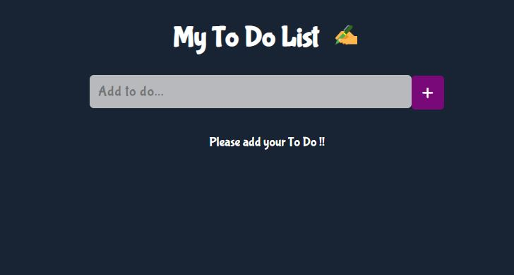
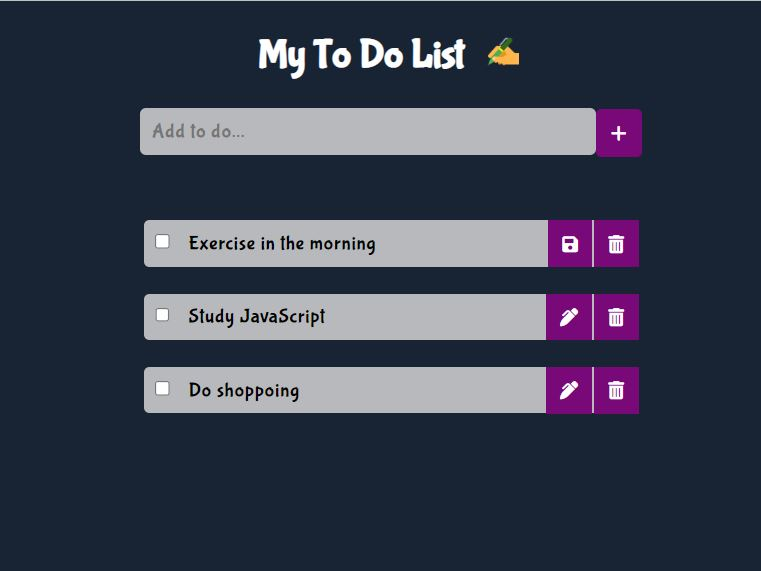
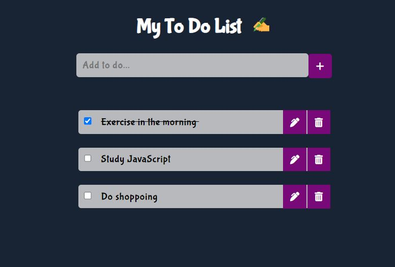

<h1>To Do List</h1>

In the 2nd week of 2nd month we have given the task of creating To Do List using javascript. Here I have used local storage to save every list to be added by user. 

I have created edit, save & delete button.

Also set line-through on completed task.
 
